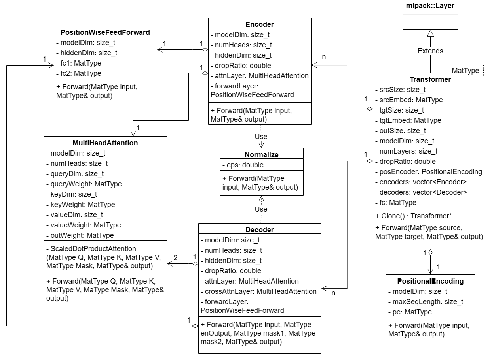

# Introduction

mlpack-like Transformer

- [x] Forward
- [x] Backward

# Theory
## Multi-Head Attention
$$
\begin{aligned}
y &= W \cdot M \cdot v \\
\frac{\partial y}{\partial M} &= \\
\frac{\partial \mathcal{L}}{\partial M} &= W^T \cdot \frac{\partial \mathcal{L}}{\partial y} \cdot v^T
\end{aligned}
$$

$$
\begin{aligned}
Y &= (W \cdot q \cdot k^T) \odot M \\
\frac{\partial Y}{\partial q} &= W^T \cdot M \cdot k \\
\frac{\partial \mathcal{L}}{\partial \mathcal{q}} &= W^T \cdot (\frac{\partial \mathcal{L}}{\partial Y} \odot M) \cdot k
\end{aligned}
$$
